# Awesome Policy Administration System (PAS) Platforms Ecosystem 🛡️ 💼 ⚙️

  
  

**Curated List of Enterprise SaaS Platforms & Open-Source GitHub Projects for Insurance Core Operations** 🚀  
*Focused on Policy Lifecycle Management, Product Configuration, Quoting, Issuance, Underwriting, Endorsements, Renewals & Claims Operations* 📊  
**Last updated: September 2026** 📅

---

## 📖 Introduction & Overview ℹ️

This repository tracks top-tier **SaaS / enterprise platforms** and **open-source projects** for **Policy Administration Systems (PAS)** in insurance. Policy Administration Systems serve as the foundational core engine for insurance carriers, MGAs (Managing General Agents), and InsurTechs, managing the full policy lifecycle — from rating and product definition to quoting, underwriting, issuance, endorsements, renewals, and cancellations across P&C (Property & Casualty), Life, Health, and Specialty lines. 🏢

### 📈 Sector Market Size & Market Dynamics

> 💡 **Market Size & Structure Note:**  
> The global **Policy Administration System (PAS) market size** is estimated at **~$10.5 Billion to $12.8 Billion USD** (2026) and is projected to expand at a CAGR of ~11.8% toward $20+ Billion by 2030.  
> The market structure is **moderately fragmented**: while legacy carriers rely heavily on a small group of market leaders (**Guidewire**, **Duck Creek**, **Socotra**, **Sapiens**, **Majesco**), specialized regional platforms and emerging modern cloud-native / API-first InsurTech platforms continue to capture significant market share across MGAs and boutique lines.

---

## 📌 Table of Contents 📑
- [SaaS/Hosted Platforms](#saashosted-platforms-)
- [Open-Source GitHub Projects](#open-source-github-projects-)
- [📈 Star History](#-star-history)
- [💖 Support & Sponsorship](#-support--sponsorship)
- [🤝 How to Contribute](#-how-to-contribute)
- [⚠️ Disclaimer](#%EF%B8%8F-disclaimer)

---

## 🏢 SaaS/Hosted Platforms ☁️

Below is a curated comparison table of commercial enterprise SaaS platforms for insurance policy administration, sorted descending by **Company Market Cap / Enterprise Valuation**.

| SaaS Platform 🏢 | Description 📝 | Market Cap / Enterprise Valuation 💰 | Pricing (Starting Tier) 💵 | Free Tier / Free Trial Limits 🎁 |
| :--- | :--- | :--- | :--- | :--- |
| **[Guidewire PolicyCenter](https://www.guidewire.com/)** | Industry-standard enterprise policy administration system for large P&C carriers, part of Guidewire InsuranceSuite. | **~$10.5 Billion** (Public: NYSE: GWRE) | Enterprise quote-based (typically starting ~$1.5M/yr based on Direct Written Premium & user count) | No free tier or public free trial available; custom sandbox environment provided upon request/sales demo |
| **[Duck Creek Policy](https://www.duckcreek.com/)** | Cloud-native policy administration platform with strong product configuration and rating capabilities for mid-to-large insurers. | **~$2.6 Billion** (Acquired by Vista Equity Partners) | Enterprise SaaS quote-based (subscription scales by lines of business & policy volume) | No free tier or public free trial available; guided product demo and POC environments provided on request |
| **[Oracle Health Insurance](https://www.oracle.com/)** | Oracle’s health insurance policy and claims administration solutions for health carriers and payers. | **~$380+ Billion** (Oracle Corp parent valuation; OHI business segment ~$2.0 Billion) | Enterprise quote-based (tiered by covered lives/members & core modules) | No free tier or standard free trial available; Oracle Cloud demo environment upon request |
| **[Sapiens IDITS / CoreSuite](https://www.sapiens.com/)** | Comprehensive policy administration and core insurance solutions covering P&C and Life & Pensions lines. | **~$1.8 Billion** (Public: NASDAQ: SPNS) | Enterprise quote-based (tiered subscription based on policy volumes & deployed modules) | No free tier or free trial available; tailored demonstration provided upon sales consultation |
| **[Majesco Policy](https://www.majesco.com/)** | Cloud insurance platform offering policy administration for multiple lines of business. | **~$750 Million** (Acquired by Thoma Bravo) | Enterprise cloud subscription quote-based (tiered by transaction volume & business lines) | No free tier or public free trial available; demo environment scheduled via sales team |
| **[Insurity Policy Decisions](https://www.insurity.com/)** | Policy administration and related core systems focused on P&C insurers and MGAs. | **~$650 Million** (PE Backed / GI Partners) | Enterprise quote-based (tiered by MGA/carrier gross written premium & user seats) | No free tier or free trial available; custom demo environment provided for qualified carriers/MGAs |
| **[Socotra](https://www.socotra.com/)** | Cloud-native, API-first policy administration platform designed for rapid product launches and modern insurance operations. | **~$450 Million** (Venture Backed / Series C) | Enterprise cloud subscription quote-based (tiered by product modules & policy volume) | No free tier or standard free trial available; developer access/sandbox granted via sales agreement & demo |
| **[Keylane](https://www.keylane.com/)** | Policy administration and core systems with strong presence in European insurance markets. | **~$350 Million** (PE Backed / Waterland Private Equity) | Enterprise quote-based SaaS (tiered by active policy count & lines of business) | No free tier or public free trial available; private client demo provided upon request |
| **[Instanda](https://www.instanda.com/)** | No-code/low-code insurance product and policy administration platform enabling rapid configuration and launch of insurance products. | **~$250 Million** (Venture Backed / Series B) | Enterprise SaaS quote-based (tiered subscription based on product count & written premium) | No free tier; 14-day to 30-day proof-of-concept (POC) sandbox trial available for qualified insurers |
| **[EIS PolicyCore](https://www.eisgroup.com/)** | Digital insurance platform including policy administration capabilities for carriers seeking modern core systems. | **~$200 Million** (Venture / PE Backed) | Enterprise quote-based subscription (scaled by carrier premium volume & active policies) | No free tier or free trial available; custom demo and evaluation sandbox available upon request |

---

## 💻 Open-Source GitHub Projects 🔓

Full-featured, regulated policy administration systems are largely commercial due to complex rating engines and compliance requirements. However, valuable open-source frameworks, policy engines, and architecture standards exist.

The table below lists top open-source repositories and standards, sorted descending by GitHub star count:

| Repository / Project 📦 | Description 📝 | GitHub Stars ⭐ |
| :--- | :--- | :--- |
| **[permitio/opal](https://github.com/permitio/opal)** |  | Open Policy Administration Layer for real-time authorization and policy lifecycle state updates. |
| **[hyperjumptech/grule-rule-engine](https://github.com/hyperjumptech/grule-rule-engine)** |  | Go-based rule engine library for executing complex insurance rating rules, underwriting policies, and risk calculations. |
| **[allianz/ng-aquila](https://github.com/allianz/ng-aquila)** |  | Allianz Open Insurance UI Component Library for building carrier customer portals and policy management dashboards. |
| **[aposin/openinsuranceplatform](https://github.com/aposin/openinsuranceplatform)** |  | Open-source core insurance platform covering policy lifecycle, claims, billing, and party management capabilities. |
| **[daxaxelrod/open_insure](https://github.com/daxaxelrod/open_insure)** |  | Open-source group and mutual insurance policy administration and claims handling engine. |
| **[jimbrig/openinsurance-apispec](https://github.com/jimbrig/openinsurance-apispec)** |  | OpenAPI specification and data model standard for interoperable insurance policy administration microservices. |

---

## 📈 Star History

---

## 💖 Support & Sponsorship ☕

Thank you for visiting and supporting the **Awesome Policy Administration System Ecosystem** repository! 🌟  
If you find this list useful for your architectural research, InsurTech evaluation, or career in insurance technology:

- **Star this repository** to help others discover it! ⭐
- **Fork & Share** it with your team, CIOs, and InsurTech engineers! 🔄
- Consider supporting ongoing maintenance by buying a coffee via the link below:

👉 **[Sponsor & Buy a Coffee on GitHub Sponsors](https://github.com/sponsors/ishandutta2007)** ☕

---

## 🤝 How to Contribute 🛠️

1. Fork the repository.
2. Add or update entries in `README.md` maintaining the existing tabular format.
3. Submit a Pull Request (PR) with factual references to official product documentation.

---

## ⚠️ Disclaimer 📜

This list is community-curated for informational purposes and does not constitute formal software endorsement or legal advice. Core policy administration systems manage regulated financial transactions and must comply with jurisdiction-specific insurance laws.

---

**Made with ❤️ for Insurance CIOs, Core System Architects, MGAs, and InsurTech Teams.**
